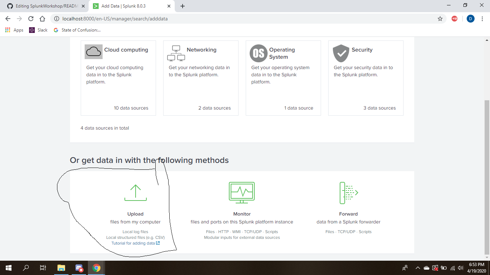
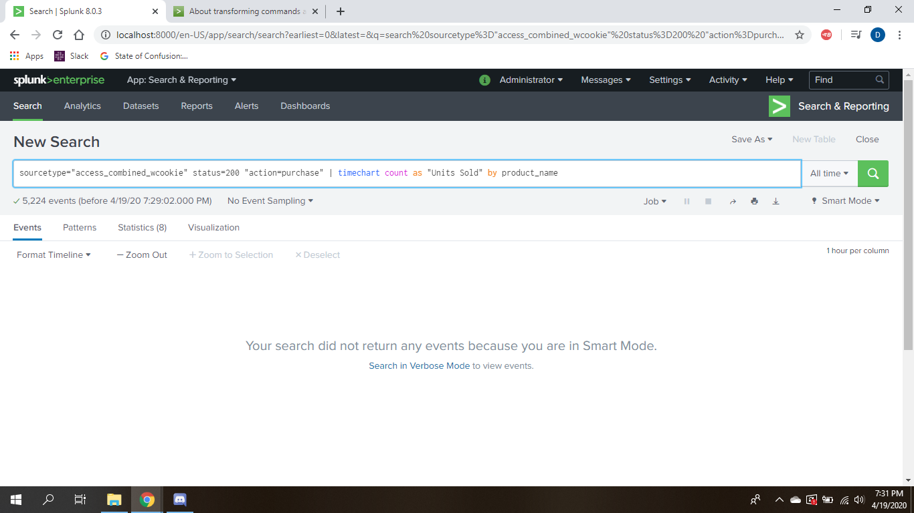
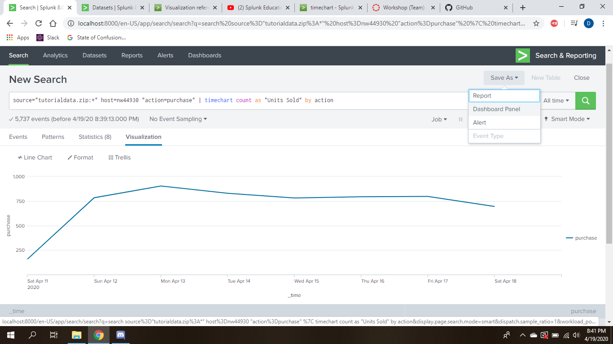

# SplunkWorkshop

## Visualizations in Splunk
Along with searching through machine data, Splunk is a great application for creating visuals with said data. I will be working through the steps of uploading data, and creating a useful visualization with the data.

## Step One - Install Splunk

Download Spunk enterprise, I won't be covering this part in the tutorial, but the documentation can be found here. https://docs.splunk.com/Documentation/Splunk/8.0.3/Installation/InstallonWindows

## Step Two - Add Data
Upload your data, in my case i am using the tutorial dataset provided by splunk. This will put your data into the splunk ecosystem, and allowed for it to be accessed by all the splunk tools

## Step Three - Searching the Data
Dashboards and visualizations are something you do in conjunction with searching. The goal would be to search for something that needs to be monitored, then create a dashboard of the data aggregation. The second half of my search below, is what allows the data to be graphed.

## Step Four - Editing the visuals, and saving as a dashboard
After searching the data for parameters you like, switch to the visualizations tab of Splunk, and this will allow you to edit your visuals, which I will cover more in the video!

